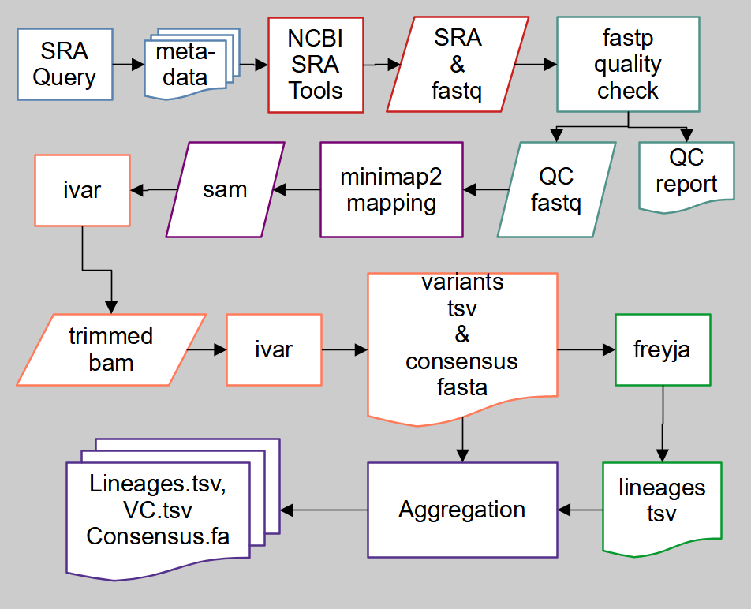

# SHED Backend Pipeline

This folder contains the scripts and tests for the backend bioinformatics pipeline for SHED.  This pipeline will query NCBI's SRA with a string in the config.yaml (see below) to obtain sample metadata (saved with a timestamp tag) and then download and process the raw sequencing data.
## Dependencies
The pipeline uses snakemake.  Please make sure [snakemake 7.8+](https://snakemake.readthedocs.io/en/stable/) and [Miniconda](https://docs.conda.io/en/latest/miniconda.html) are installed.  Users must also install [NCBI's SRA Tools](https://github.com/ncbi/sra-tools) v3.0, downloadable at https://ftp-trace.ncbi.nlm.nih.gov/sra/sdk/3.0.0/ for specific opererating systems.  Test the functionality of SRA Tools with:
```bash
$ prefetch -V
$ fasterq-dump -V
```
These should indicate version 3.0 for the tools. And
```bash
$ prefetch SRR17866146
```
should download SRR17866146.sra into the directory SRR17866146/. The pipeline will install the remaining following dependencies itself upon the first run:


[fastp](https://github.com/OpenGene/fastp)

[minimap2](https://github.com/lh3/minimap2)

[ivar](https://github.com/andersen-lab/ivar)

[freyja](https://github.com/andersen-lab/Freyja)

If an error arrises indicating the pipeline was unable to install one or more of these programs, the user may need to provide a pristine conda environment for the pipeline.

## Operation
To run the pipeline, clone this repository and use the command:
```bash
path/to/SHED/backend:$ bash pipeline.sh
```
You will be asked to provide the number of processor cores to use in running the pipeline before starting.  The first run will require significant additional processing time for snakemake to download and build environments for the pipeline's dependencies.  The general workflow is depicted below.



Aside from the number of cores used by the pipeline, some other aspects can be changed by editing the config.yaml file in the SHED/backend directory.  To modify the NCBI SRA query string, edit the query variable in the config.yaml file, ie:
```
    query:
        wastewater+SARS-CoV-2+USA
```
To insure the correct query pattern, you may wish to run the query with [NCBI's web interface](https://www.ncbi.nlm.nih.gov/sra) and copy the string from the resulting url.  Having no query string in the config.yaml will lead to the pipeline using the previous run (assuming the query results are present).  If a query returns unusable (no) results, the pipeline will report such and exit.

Metadata for the samples returned by the query are downloaded and processed into files with a timestamp in the name.  To use a custom ID instead of a timestamp, put the desired ID into the config.yaml run_ID entry, ie:
```
    run_ID:
        run1
```

SRA samples that have already been downloaded and processing will will be reprocessed if the flag in the config.yaml is set to True
```
    reprocess:
        True
```
and will not be reprocessed if the flag is set to False
```
    reprocess:
        False
```
Any samples that aren't found by NCBI's SRA Tools prefetch aren't processed further and a file is written to the SRAs/ directory indicating no data for that accession.
Lineage assignment by freyja is based on updatable lineage definitions.  To have the pipeline update the definitions, change the config.yaml freyja_update entry to True.
'''
    freyja_update:
        True
'''

## Workflow Details
The pipeline is split into three snakefiles/sections and relies on python functions found in modules/snakefuncions.py.  Each snakefile may be run separately, ie
```bash
path/to/SHED/backend:$ snakemake -cN --use-conda -k -F -s snakefile1
```
The first section, snakefile1, is responsible for calling functions to query NCBI's SRA and obtain/process the metadata for the search's results.  The query results will be saved as search_results_TIMESTAMP.html, with the TIMESTAMP based on the time of running.  Partial and complete metadata will be downloaded as sra_data_TIMESTAMP.csv sra_meta_TIMESTAMP.xml respectively.  The xml will be converted into a more readable format as sra_meta_TIMESTAMP.txt and select metadata (accession, collection date, location and primer.bed) written to sra_meta_collect_TIMESTAMP.tsv.
For the current run, the latter will also be written to sra_meta_collect_current.tsv.  With these results, a snakemake rule downloads sra files for each sample via NCBI SRA Tools' prefetch in the SRAs subdirectory.
The second section handles writing the fastq files with NCBI SRA Tools' fasterq-dump, checking the reads' qualities using fastp and mapping quality passed reads with minimap2.  For samples that don't have known primers, fastp also trims 25nts from the 5' end of the reads. The outputs for this section are written in the fastqs subdirectory or the sams subdirectory for the mapping.  The final section continues to process samples that have over 500 reads that mapped to the reference SARS-CoV-2 genome (NC_045512.2).  This section trims primers, calls variants and generates consensus using ivar, and assigns lineages with freyja.  Trimmed mapped reads are written to the sams subdirectory in bam format.  For each sample processed fully, the endpoints subdirectory will contain the tsv files for the variants and lineages, depth and quality files, and fasta files for the consensus sequence.  Data for all processed samples are aggregated into VCs.tsv for variants, Lineages.tsv for lineages and Consensus.fa for consensus.

## Output file details

The querying process generates 6 files in the working directory, all but one using the timestamp or user defined id in the name.
search_results_TIMESTAMP.html - Webpage showing the first page of the query result and contains search id and key used for downloading metadata

sra_data_TIMESTAMP.csv - basic metadata for the samples from the query result

sra_meta_TIMESTAMP.xml - full metadata for the samples from the query result, not easily human readable

sra_meta_TIMESTAMP.txt - full metadata for the samples from the query result, json like human readable

sra_meta_collect_TIMESTAMP - the sra accession, collection date, geographic location and primers for the samples from the query result

sra_meta_collect_current - the sra accession, collection date, geographic location and primers for the samples from the most recent query result


For each sample from the current query, the pipeline will generate intermediate and endpoint files.  For the following are examples for the accession SRR17866146:
SRAs/SRR17866146/SRR17866146.sra - sequencing data in a compressed format downloaded by SRA Tools prefetch, if no data was found SRR17866146.no.data would be written no further processing would occur

fastqs/SRR17866146_1.fastq, SRR17866146_2.fastq - fastq files of the sequencing data.  If single end data, the file would be SRR17866146.fastq. Generated by SRA Tools fasterq-dump

fastqs/SRR17866146_1.qc.fq, SRR17866146_2.qc.fq - quality filtered fastq files generated by fastp. If single end data, the file would be SRR17866146.qc.fq.

fastqs/SRR17866146.pe.json - quality report generated by fastp. pe indicated paired end, se would be used for single end data.

fastqs/SRR17866146.pe.html - quality report generated by fastp with graphics. pe indicated paired end, se would be used for single end data.

sams/SRR17866146.sam - reads mapped to SARS-CoV-2 by minimap2

sams/SRR17866146.bam - the above same in a sorted bam format generated by samtools (packaged with ivar).  This file will not be generated and no further processing continued if there are not at least 500 reads mapped.

sams/SRR17866146.bam.bai - index of the above bam generated by samtools (packaged with ivar)

sams/SRR17866146.trimmed.bam - mapped reads trimmed of primers by ivar

sams/SRR17866146.trimmed.sorted.bam - sorted bam of the primer trimmed reads (samtools)

sams/SRR17866146.trimmed.sorted.bam.bai - index of the above bam (samtools)

endpoints/SRR17866146.fa - consensus sequence in fasta format generated by ivar

endpoints/SRR17866146.qual.txt - phred quality associated with the consensus, generated by ivar

endpoints/SRR17866146.depth - sequence depth report generated by samtools (packaged with ivar)

endpoints/SRR17866146.tsv - snp variants called by ivar with associated animo acid changes

endpoints/SRR17866146.lineages.tsv - lineage report generated by freyja


The sample data are collected into three aggregate files.

Consensus.fa - fasta of all the consensus sequences

VC.tsv - called variants

Lineages.tsv - lineage reports


In addition to the above outputs, most processes will have logs written to the logs subdirectory that contain the standard and error messages generated by the process program.

## Testing
The pipeline and its modules are tested with [pytest](https://docs.pytest.org/en/7.1.x/).  The testing scripts can be found in the tests subdirectory.  To run the tests, run pytest in the backend directory.

```bash
path/to/SHED/backend:$ pytest
```
